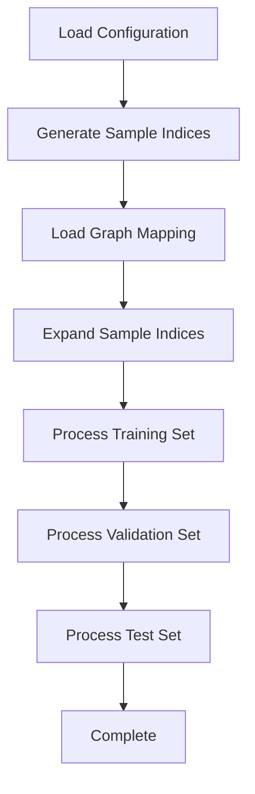

# passive biv

## Main Data Preparation

### Overview

The `main_data_preparation.py` and `step0_start_data_preparation` script is the core data processing module for the Passive BiV heart model. It handles dataset generation, graph mapping, and data splitting for training, validation, and testing purposes.

### Features

- 🧠 **Heart Data Processing**: Specialized processing for biventricular heart simulation data
- 📊 **Dataset Splitting**: Automatic train/validation/test set generation
- @ **Graph Mapping**: Handles mapping between generated and original graphs
- 🎲 **Random Sampling**: Configurable random sampling with seed control
- ⚙️ **Flexible Configuration**: YAML-based configuration system

### Usage

#### Basic Usage

```bash
## Run with default configuration
python main_data_preparation.py

## Run with custom configuration file
python main_data_preparation.py --config_path task/passive_biv/data_pipeline/config/data_config.yaml

## Run script file
sh step0_start_data_preparation.sh
```

#### Command Line Arguments

| Argument | Type | Default | Description |
|----------|------|---------|-------------|
| `--config_path` | str | `task/passive_biv/data_preparation/config/data_config.yaml` | Path to configuration file |

### Configuration

The script requires a YAML configuration file with the following parameters:

```yaml
task_name: "passive_biv"           # Task identifier
start_index: 0                     # Starting index for samples
sample_size: 64                    # Total number of samples
train_split_ratio: 0.8            # Training set ratio (0.0-1.0)
```

### Data Processing Pipeline



### Common Question
1. How to Generate/Clean a New Dataset?
- Currently, the original dataset and cleaned dataset are stored in the same directory by default, which is data/task_name (by default, task_name=passive_biv). 

- If you want to generate a completely new dataset, consider changing the task_name in the configuration file. Steps to Generate a New Dataset: 
  - (1) Modify Configuration File
  ```yaml
    task_name: "your_new_dataset"           # Task identifier
  ```
  - (2) Copy the raw dataset under your new directory structure
  ```text
    data/
    ├── passive_biv/          # Original dataset directory
    └── your_new_task_name/   # paste raw dataset to new dataset directory
  ```
  - (3) If necessary, consider to change the seed number