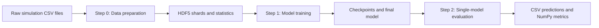

# Passive BiV Task

This directory contains the end-to-end workflow for training a graph neural network to predict nodal displacement from passive biventricular finite-element simulations.

The workflow has three ordered stages:

1. Prepare raw simulation data as HDF5 datasets and normalization statistics.
2. Train the `fe_heart_sim_sage` model and save checkpoints.
3. Evaluate a trained model on selected cases and export predictions and error metrics.

Run every command in this document from the repository root.



## Prerequisites

Create and activate the project environment, then install the dependencies:

```bash
conda create --name phy_gnn python=3.8.18
conda activate phy_gnn
pip install -r requirements.txt
```

The launcher scripts set `PYTHONPATH` automatically. When invoking a Python entry point directly, set it explicitly:

```bash
PYTHONPATH="$PWD" python path/to/script.py
```

## Input data layout

The value of `dataset_name` determines the data root:

```text
data/<dataset_name>/
├── generated_to_original.csv
├── record_global_feature.csv
├── record_shape.csv
├── record_inputs/
│   ├── ct_case_0001.csv
│   ├── ct_case_0002.csv
│   └── ...
└── record_results/
    ├── ct_case_0001.csv
    ├── ct_case_0002.csv
    └── ...
```

The preparation code expects the following columns:

| Source | Columns | Meaning |
| --- | --- | --- |
| `record_inputs/ct_case_XXXX.csv` | `0:3` | 3D node coordinates |
| | `3:11` | Eight Laplace-coordinate features |
| | `11:17` | Six fiber and sheet features |
| `record_results/ct_case_XXXX.csv` | `0:3` | Three displacement targets |
| | `3:4` | One stress target |
| `record_global_feature.csv` | `1:7` | Six material parameters |
| | `7:9` | Two pressure values |
| | `9:10` | One time value |
| `record_shape.csv` | `1:59` | Fifty-eight shape coefficients |

`generated_to_original.csv` is read as a two-column, headerless CSV:

```text
<original_case_id>,<generated_case_id>
```

It keeps augmented graphs in the same split as their original graph when `--restrict_extend` is enabled. The file is currently loaded even when split extension is disabled, so it must be present.

## Configuration files

Each stage owns a separate configuration file:

| Stage | Configuration file | Main purpose |
| --- | --- | --- |
| Step 0 | `task/passive_biv/data_preparation/config/data_config.yaml` | Dataset range, split, HDF5 shards, graph edges, and node downsampling |
| Step 1 | `task/passive_biv/fe_heart_sim_sage/config/train_config.yaml` | Experiment, device, loader, optimizer, callbacks, and model architecture |
| Step 2 | `task/passive_biv/model_eval/config/eval_config.yaml` | Model path, evaluation data, graph edges, sampled metrics, and output directory |

Keep `dataset_name` consistent across all three files. Step 1 and Step 2 both consume artifacts generated by Step 0.

---

## Step 0 — Prepare the dataset

### Run the step

Use the default configuration:

```bash
bash task/passive_biv/step0_start_data_preparation.sh
```

Use a different configuration file:

```bash
PYTHONPATH="$PWD" python task/passive_biv/main_data_preparation.py \
  --config_path task/passive_biv/data_preparation/config/data_config.yaml
```

The script uses NumPy seed `753` before splitting and shuffling cases. It creates training and validation indices, optionally expands them through the graph mapping, and intentionally copies the validation indices to the test split.

### Data-preparation configuration

```yaml
dataset_name: passive_biv

# Raw cases are ct_case_0001.csv through ct_case_0061.csv.
start_index: 1
sample_size: 61
train_split_ratio: 0.9

# Choose a value no larger than the smallest split.
chunk_file_size: 5

# WARNING: true removes and regenerates the corresponding directories.
overwrite_data: true
overwrite_stats: true

# Neighbor rank boundaries and samples selected from each rank interval.
sections: [0, 20, 100, 250, 500, 1000]
nodes_per_sections: [20, 30, 30, 10, 10]

# Use a fixed node count when raw meshes have different sizes.
train_down_sampling_node: 10000
val_down_sampling_node: 10000
```

### Field reference

| Field | How to adjust it |
| --- | --- |
| `dataset_name` | Selects `data/<dataset_name>`. Change it when preparing a separate dataset, then use the same value in training and evaluation. |
| `start_index` | First one-based case ID. A value of `1` starts at `ct_case_0001.csv`. |
| `sample_size` | Number of consecutive raw cases. The last case ID is `start_index + sample_size - 1`. |
| `train_split_ratio` | Fraction assigned to training. Training size is `int(sample_size * ratio)`; the remainder becomes validation. Test currently reuses validation. |
| `chunk_file_size` | Approximate number of samples per HDF5 shard. It must not exceed the size of any generated split. See the sizing rule below. |
| `overwrite_data` | When `true`, existing `datasets/<split>` directories are deleted and regenerated. Set `false` to preserve existing HDF5 data. |
| `overwrite_stats` | When `true`, existing `stats/<split>` directories are deleted and regenerated. Set `false` to preserve statistics. |
| `sections` | Boundaries over neighbors sorted by distance. These are rank positions, not coordinate distances. |
| `nodes_per_sections` | Number of neighbors sampled without replacement from each corresponding rank interval. Its length must be `len(sections) - 1`. |
| `train_down_sampling_node` | Number of nodes retained per training case. Use `null` to disable downsampling. |
| `val_down_sampling_node` | Number of nodes retained per validation/test case. Use `null` to disable downsampling. |

### Important sizing rules

For `sample_size: 61` and `train_split_ratio: 0.9`:

```text
training cases   = int(61 × 0.9) = 54
validation cases = 61 - 54       = 7
test cases       = validation     = 7
```

The current implementation computes the number of shards as:

```text
number_of_shards = split_size // chunk_file_size
```

Therefore, `chunk_file_size` must be less than or equal to the smallest split size. For the example above, use `7` or less. A value such as `25` would produce zero validation shards and fail during data preparation.

> **Before the first run:** the checked-in configuration currently combines `sample_size: 61`, `train_split_ratio: 0.9`, and `chunk_file_size: 25`. With the launcher's default unexpanded split, the validation/test size is only seven, so reduce `chunk_file_size` before running Step 0. The `5` shown above is a safe example.

Each neighbor band must also satisfy:

```text
len(nodes_per_sections) == len(sections) - 1
nodes_per_sections[i] <= sections[i + 1] - sections[i]
sections[-1] <= retained_node_count - 1
```

For the example configuration, every node stores:

```text
20 + 30 + 30 + 10 + 10 = 100 neighbor indices
```

If meshes have different node counts and `batch_size` will be greater than one, set both downsampling fields to a common value that does not exceed the smallest raw mesh.

### Restrict augmented cases to their source split

The launcher uses the default value, which does not expand the split. To include generated graphs in the same split as their source graph, run:

```bash
PYTHONPATH="$PWD" python task/passive_biv/main_data_preparation.py \
  --config_path task/passive_biv/data_preparation/config/data_config.yaml \
  --restrict_extend True
```

### Outputs

```text
data/<dataset_name>/
├── datasets/
│   ├── train/data_0.h5
│   ├── validation/data_0.h5
│   └── test/data_0.h5
└── stats/
    ├── train/
    │   ├── data_size.npy
    │   ├── node_coord_stats.npz
    │   ├── node_laplace_stats.npz
    │   ├── fiber_and_sheet_stats.npz
    │   ├── mat_param_stats.npz
    │   ├── pressure_stats.npz
    │   ├── time_stats.npz
    │   ├── shape_coeff_stats.npz
    │   ├── displacement_stats.npz
    │   └── stress_stats.npz
    ├── validation/
    └── test/
```

Training, validation, and evaluation normalize inputs with statistics from `stats/train`.

---

## Step 1 — Train the model

### Run the step

```bash
bash task/passive_biv/step1_start_model_train.sh
```

The launcher defaults to `fe_heart_sim_sage`. It can also accept a model directory name as its first option:

```bash
bash task/passive_biv/step1_start_model_train.sh --model_name fe_heart_sim_sage
```

The selected configuration is:

```text
task/passive_biv/<model_name>/config/train_config.yaml
```

### Training configuration structure

The file has four sections:

```yaml
task_base:     # Experiment identity, logs, and GPU placement
task_data:     # Dataset identity and graph sampling during training
task_trainer:  # Epochs, optimizer, loaders, callbacks, and resume behavior
task_train:    # Neural-network architecture and prediction labels
```

### `task_base`: experiment and device

```yaml
task_base:
  task_name: passive_biv
  model_name: fe_heart_sim_sage
  exp_name: base
  overwrite_exp_folder: true
  gpu: true
  cuda_core: 0
  gpu_num: 2
```

| Field | How to adjust it |
| --- | --- |
| `task_name` | Must remain `passive_biv` unless the task directory and launcher are also changed. |
| `model_name` | Must match the model directory and launcher argument. |
| `exp_name` | Names the run under `log/passive_biv/<exp_name>`. Use a unique value for each experiment. |
| `overwrite_exp_folder` | `false` stops if the experiment directory exists. `true` reuses the directory; it does not fully clean old artifacts. |
| `gpu` | Requests CUDA. The trainer automatically falls back to CPU when CUDA is unavailable. |
| `cuda_core` | First CUDA device index. Use `0` for the first visible device. |
| `gpu_num` | Number of consecutive GPUs used by `DataParallel`. Use `1` for a single GPU. Ensure `cuda_core ... cuda_core + gpu_num - 1` are visible. |

For CPU-only training:

```yaml
task_base:
  gpu: false
  cuda_core: 0
  gpu_num: 1
```

### `task_data`: dataset and graph sampling

```yaml
task_data:
  dataset_name: passive_biv
  select_node_num: 300
  select_edge_num: 12
  normalize_val_objective: false
```

| Field | How to adjust it |
| --- | --- |
| `dataset_name` | Must match Step 0. Training reads `data/<dataset_name>/datasets` and `stats/train`. |
| `select_node_num` | Number of center nodes used in each training forward pass. Larger values increase memory and compute. Current sampling uses replacement, so duplicate node IDs are possible. |
| `select_edge_num` | Number of stored neighbor positions sampled for each center node at each forward pass. Larger values increase message-passing cost. |
| `normalize_val_objective` | `false` keeps validation displacement in physical units and de-normalizes predictions before validation loss/metrics. `true` compares validation data in normalized space. |

`select_node_num` affects training only. Validation evaluates every retained node.

### `task_trainer`: optimization and runtime

```yaml
task_trainer:
  epochs: 3000

  optimizer_param:
    name: adam
    learning_rate: 0.0001

  loss_param:
    name: euclidean_distance_mse

  metrics_param:
    - mean_absolute_error

  callback_param:
    tensorboard:
      profiler: false
    model_checkpoint:
      save_freq: 100
      save_model_freq: 200
      save_best_model: true
      eval_loss_name: displacement_val_loss
    logs:
      update_freq: 1
      save_config: true
      save_task_code: true
    scheduling:
      avoid_work_hour: false

  dataset_param:
    shuffle_queue_size: 5
    batch_size: 20
    val_batch_size: 6
    num_workers: 2
    val_num_workers: 1
    prefetch_factor: 1
    val_prefetch_factor: 1
    pin_memory: true
    persistent_workers: false

  static_graph: false
  init_model_weights: false
```

#### Optimizer and scheduler

| Field | Guidance |
| --- | --- |
| `epochs` | Total epoch to reach, including a resumed run. |
| `optimizer_param.name` | The current trainer supports `adam`. |
| `learning_rate` | Start with `1e-4`; reduce it when loss is unstable and increase cautiously when convergence is too slow. |
| `loss_param.name` | Use `euclidean_distance_mse` for vector displacement prediction. |
| `metrics_param` | Supported entries are `mean_absolute_error` and `explained_variance`. |

The default scheduler multiplies the learning rate after every batch. With no `decay_per_step`, its factor is `1.0`, so the learning rate stays constant.

To enable a multi-step schedule:

```yaml
optimizer_param:
  name: adam
  learning_rate: 0.0001
  scheduler: multi_step
  milestones: [250, 500, 750]
  batch_per_epoch: 200
  decay_per_step: 0.5
```

`milestones` are expressed as epochs but converted internally to optimizer steps using `batch_per_epoch`. Set `batch_per_epoch` to the actual number of training batches, or to `per_epoch_steps` when that optional trainer setting is used.

#### DataLoader settings

| Field | Guidance |
| --- | --- |
| `shuffle_queue_size` | Number of streamed samples held for approximate shuffling. Increase for better mixing at the cost of memory. |
| `batch_size` | Training cases per batch. Reduce it for GPU out-of-memory errors. Cases in a batch must have compatible tensor shapes. |
| `val_batch_size` | Validation cases per batch. It can usually be larger because gradients are disabled. |
| `num_workers` | Training loader workers. It must not exceed the number of training HDF5 shards. |
| `val_num_workers` | Validation loader workers. It must not exceed the number of validation HDF5 shards. If omitted, it inherits `num_workers`. |
| `prefetch_factor` | Batches prefetched by each training worker. Use `null` when `num_workers` is `0`. |
| `val_prefetch_factor` | Validation equivalent of `prefetch_factor`. |
| `pin_memory` | Set `true` for faster host-to-GPU copies when enough host memory is available. |
| `persistent_workers` | Keeps workers alive between epochs. Use only when worker counts are greater than zero. |

The worker-to-shard constraint is strict. For example, if Step 0 creates ten training shards and one validation shard, use at most:

```yaml
num_workers: 10
val_num_workers: 1
```

The checked-in training configuration uses `num_workers: 20` and does not define `val_num_workers`. Recalculate both values after Step 0; otherwise the validation loader inherits `20` and may exceed its shard count. The example configuration above intentionally uses safer values.

#### Callbacks and checkpoints

| Field | Guidance |
| --- | --- |
| `tensorboard.profiler` | Enables the PyTorch profiler. Keep it `false` for normal long-running training because traces can be large. |
| `model_checkpoint.save_freq` | Save a resumable checkpoint every N epochs, or use `epoch` to save every epoch. |
| `save_model_freq` | Serialize the complete model every N epochs. Use `null` to disable periodic full-model saves. |
| `save_best_model` | Saves an epoch-suffixed model whenever the selected validation loss improves. |
| `eval_loss_name` | Must match a validation metric key. For displacement, use `displacement_val_loss`. |
| `logs.update_freq` | Epoch interval for metric logging, or `epoch`. |
| `save_config` | Copies the run configuration into the log directory. |
| `save_task_code` | Copies task code into the log directory for reproducibility. |
| `scheduling.avoid_work_hour` | When `true`, pauses on weekdays from 10:00 to 18:00 and temporarily releases GPU memory. |
| `init_model_weights` | When `true`, resumes from `checkpoint/ckpt.pth` inside the current experiment directory. |
| `static_graph` | Enables `torch.jit.trace`. Leave `false` while changing dynamic graph sampling or debugging. |

### `task_train`: architecture

The default attention architecture follows these dimensions:

```text
Laplace encoder:       8   -> 128
Fiber/sheet encoder:   6   -> 128
Global encoders:       ... -> 128 each, then added together
Center-node embedding: 128 + 128 + 128 = 384
Edge-coordinate MLP:   3   -> 384
Edge-Laplace MLP:      8   -> 384
Attention d_model:           384
Message-update output:       384
Decoder input:               384
Decoder outputs:             3 × 1 displacement components
```

These widths are coupled. If one of the `128` encoder widths changes, update the center-node width, both edge encoders, attention `d_model`, message-update output, and decoder input so additions and residual connections still have matching dimensions.

Key architecture settings:

| Field | Guidance |
| --- | --- |
| `input_layer.<feature>.unit_sizes` | First value must match the raw feature width shown in the input-data table. Last value is the encoded width. |
| `activation` | Supported values are `relu`, `tanh`, `rrelu`, and `LeakyReLU`. |
| `init_func` | Supported values are `xavier_uniform` and `xavier_normal`. |
| `message_passing_layer.agg_method` | Use `MeanAggregator` or `SUMAggregator`. |
| `message_passing_layer.arch` | The current default is `attention`; `mlp` requires a message MLP whose input width matches the concatenated center, neighbor, and coordinate embeddings. |
| `agg_layer.agg_dim` | Keep `2` to pool the neighbor-sequence axis. |
| `message_update_layer.d_model` | Must match the center and edge embedding width. |
| `message_update_layer.n_heads` | Must divide `d_model` exactly. For `d_model: 384`, values such as `4`, `6`, `8`, or `12` are valid. |
| `message_update_layer.dropout` | Attention-weight dropout. Typical values are `0.0` to `0.1`. |
| `decoder_layer.output_dim` | Number of independent scalar decoders. Keep `3` for XYZ displacement. |
| `labels` | Model-output keys used for loss computation. The current model produces `displacement`. |

### Training outputs

For `exp_name: base`, artifacts are written below:

```text
log/passive_biv/base/
├── checkpoint/
│   ├── ckpt.pth
│   ├── ckpt_100.pth
│   └── ...
├── model/
│   ├── model.pth
│   ├── model_200.pth
│   └── ...
├── events.out.tfevents...
└── ...
```

`checkpoint/ckpt.pth` contains model state, optimizer state, epoch, and metrics for resuming. `model/model.pth` is the final complete model used by Step 2.

Inspect TensorBoard logs with:

```bash
tensorboard --logdir log/passive_biv/base
```

---

## Step 2 — Evaluate the trained model

### Prepare the output directory

The evaluation code does not create `output_path`. Create it before running:

```bash
mkdir -p tmp_for_test
```

### Run the step

Use the default evaluation configuration:

```bash
bash task/passive_biv/step2_start_single_model_eval.sh
```

Use a custom evaluation configuration:

```bash
PYTHONPATH="$PWD" python task/passive_biv/main_single_evaluation.py \
  --config_path task/passive_biv/model_eval/config/eval_config.yaml
```

The launcher's `--model_name` value does not select the checkpoint for this stage. `model_path` in `eval_config.yaml` is the authoritative model selection.

### Evaluation configuration

```yaml
dataset_name: passive_biv
data_type: validation

sections: [0, 20, 100, 250, 500, 1000]
nodes_per_sections: [20, 30, 30, 10, 10]
down_sample_node: 10000

device: cpu
normalize_val_objective: true

model_path: log/passive_biv/base/model/model.pth

selected_node: 20
select_edge_num: 12
output_path: tmp_for_test/
```

| Field | How to adjust it |
| --- | --- |
| `dataset_name` | Must point to the raw data and prepared statistics used by the model. |
| `data_type` | Selects the prepared split metadata under `stats/<data_type>/data_size.npy`. Usually use `validation` or `test`. |
| `sections` | Neighbor rank boundaries used to reconstruct edges directly from raw node coordinates. They must satisfy the same constraints as Step 0. |
| `nodes_per_sections` | Number of reconstructed neighbors per rank interval. Keep this compatible with the graph distribution used during training. |
| `down_sample_node` | Number of nodes retained for evaluation. Use `null` to evaluate the complete raw mesh. It cannot exceed the raw node count. |
| `device` | Use `cpu` with the current entry point. The model is loaded onto CPU and the input pipeline does not currently transfer evaluation tensors to CUDA. |
| `normalize_val_objective` | Compatibility field retained in the configuration; the current single-model evaluation path does not read it. Predictions are explicitly converted back to physical units. |
| `model_path` | Path relative to the repository root. Update both `exp_name` and filename as needed, for example `log/passive_biv/experiment_02/model/model.pth`. |
| `selected_node` | Number of unique nodes randomly sampled for the saved per-node comparison arrays. It must not exceed the evaluated node count. Model inference still runs for all nodes. |
| `select_edge_num` | Number of reconstructed neighbor positions sampled by the model for each node. Use the same value as training for comparable behavior. |
| `output_path` | Directory for CSV and NPY results. Create it before evaluation. |

### Select evaluation cases

Case IDs are currently defined in `main_single_evaluation.py`, not in YAML. Edit the list following `for idx in [`:

```python
for idx in [
    2,
    3,
    11,
]:
```

These are one-based case IDs, so `2` loads `ct_case_0002.csv`.

### Evaluation behavior and outputs

For every selected case, the script:

1. Loads raw node features and reference results.
2. Reconstructs distance-ranked graph edges.
3. Normalizes model inputs with `stats/train`.
4. Runs inference for all retained nodes.
5. Converts displacement predictions back to physical units.
6. Computes aggregate L1 and Euclidean L2 errors.
7. Samples `selected_node` nodes for detailed error arrays.
8. Saves the full predicted displacement as CSV.

The output directory contains:

```text
tmp_for_test/
├── output_0002.csv
├── l1_results.npy
├── l2_results.npy
├── sample_l1_results.npy
├── sample_l2_results.npy
├── results_source.npy
└── results_pred.npy
```

| Output | Meaning |
| --- | --- |
| `output_XXXX.csv` | Full predicted XYZ displacement for one case |
| `l1_results.npy` | Per-case mean absolute errors |
| `l2_results.npy` | Per-case mean Euclidean displacement errors |
| `sample_l1_results.npy` | Signed component-wise errors for sampled nodes |
| `sample_l2_results.npy` | Euclidean errors for sampled nodes |
| `results_source.npy` | Reference displacement vectors for sampled nodes |
| `results_pred.npy` | Predicted displacement vectors for sampled nodes |

The script prints the median L1 and L2 values after all selected cases finish.

---

## Recommended configuration workflow

For a new experiment:

1. Copy raw data into `data/<new_dataset_name>`.
2. Update Step 0 `dataset_name`, case range, split ratio, shard size, and node sampling.
3. Run Step 0 and count the generated HDF5 shards in both training and validation directories.
4. Update Step 1 `dataset_name`, choose a new `exp_name`, and set worker counts no larger than those shard counts.
5. Start with the default model dimensions and reduce `batch_size`, `select_node_num`, or `select_edge_num` if memory is insufficient.
6. Run Step 1 and verify that `model/model.pth` was produced.
7. Update Step 2 `model_path`, edge settings, node counts, selected cases, and `output_path`.
8. Create the output directory and run Step 2.

## Common failures

### `number sections must be larger than 0`

`chunk_file_size` is larger than the current split. Reduce it so `split_size // chunk_file_size >= 1` for training, validation, and test.

### `the num of workers should be small or equal to num of files`

Reduce `num_workers` or `val_num_workers`, or regenerate the dataset with more HDF5 shards.

### Edge generation raises a sampling error

Check that every `nodes_per_sections` value fits inside its rank interval and that `sections[-1]` is below the retained node count.

### DataLoader cannot stack tensors

Cases have different node counts. Set fixed `train_down_sampling_node` and `val_down_sampling_node` values, or use batch size `1`.

### Attention reports incompatible tensor shapes

Verify that the center-node embedding, edge embeddings, attention `d_model`, message-update output, residual width, and decoder input all match. Also ensure `d_model` is divisible by `n_heads`.

### Evaluation cannot find the model

Set `model_path` relative to the repository root and verify that Step 1 produced `model/model.pth` for the selected experiment.

### Evaluation cannot write result files

Create `output_path` before running Step 2 and verify that the process has write permission.

## Reproducibility notes

- Data splitting starts from NumPy seed `753`.
- Model initialization starts from PyTorch seed `753`.
- Neighbor selection and DataLoader workers introduce additional randomness during training and evaluation.
- Preserve the generated split, YAML files, task-code snapshot, and checkpoint when an experiment must be reproduced exactly.


## Future Optimization Directions

### 1. Remove the data-pipeline and graph-generation bottleneck

Training currently does not fully utilize the GPU because the accelerator frequently waits for data. A major source of this idle time is the relatively slow process used to generate node neighborhoods and graph inputs for each full graph.

Before changing the model, profile the pipeline as separate stages:

1. Read raw or prepared samples from storage.
2. Decode and transform each sample.
3. Generate or sample graph edges and node neighborhoods.
4. Collate samples into a batch.
5. Transfer the batch from CPU memory to GPU memory.
6. Run the model forward and backward passes.

Track samples per second, graph-generation time, DataLoader wait time, host-to-device transfer time, GPU utilization, and peak CPU/GPU memory. This will show whether an optimization improves end-to-end throughput instead of only accelerating one isolated function.

#### Direction A: use a more efficient structured storage layout

The prepared dataset should minimize small random reads, repeated parsing, and repeated graph construction. Possible experiments include:

- Precompute reusable graph information, such as sorted neighbor candidates, edge indices, node offsets, and graph metadata, during data preparation rather than rebuilding it during every training epoch.
- Store tensors in larger contiguous shards instead of many small independently accessed objects. Keep variable-sized graphs in flat arrays accompanied by graph and node offset tables.
- Benchmark the current HDF5 layout against alternatives such as optimized HDF5 shards, Zarr, LMDB, or memory-mapped NumPy arrays. Select a format using measured sequential throughput, random-read latency, worker scalability, storage size, and recovery behavior.
- Choose shard sizes that are large enough to reduce file-open overhead but small enough to distribute across DataLoader workers.
- Cache frequently reused metadata and normalization statistics in memory.
- Move expensive deterministic preprocessing to an offline preparation stage. Keep only stochastic sampling and lightweight tensor conversion in the online training path.
- After reducing graph-generation cost, tune `num_workers`, `prefetch_factor`, `persistent_workers`, and `pin_memory` so CPU work overlaps GPU computation.

Any new format should preserve the mapping between a graph, its node features, its target values, and its precomputed edge data. It should also support deterministic regeneration and validation of every stored sample.

#### Direction B: generate multiple subgraphs from each full graph

Instead of producing only one training sample from each full graph, generate multiple subgraphs or neighborhood samples from the same graph. Each subgraph can contain a different set of center nodes and sampled neighbors. These subgraphs can then be collated as independent training items, increasing the effective batch size and exposing more parallel work to the GPU.

A possible workflow is:

1. Load or decode one full graph once.
2. Reuse its node features and precomputed neighbor candidates.
3. Sample `K` different center-node sets.
4. Build `K` subgraphs with fixed or bucketed node and edge dimensions.
5. Stack compatible subgraphs into a larger GPU batch.
6. Accumulate or aggregate their losses before the optimizer step.

Important design considerations include:

- Keep every subgraph from a source graph in the same train, validation, or test split to prevent data leakage.
- Ensure that node and neighborhood sampling does not overrepresent large graphs or frequently selected regions.
- Record the source graph ID and sampled node IDs so results remain traceable.
- Prefer fixed-size subgraphs or size-based buckets to reduce padding and simplify collation.
- Compare true larger batches, gradient accumulation, and multiple subgraphs per loaded graph; they have different memory and optimization behavior.
- Recheck normalization and metric aggregation so each graph contributes the intended weight to the objective.
- For validation, retain a deterministic full-graph or fixed-subgraph evaluation path so metrics remain comparable between experiments.

The first prototype should expose the number of subgraphs per graph, center nodes per subgraph, neighbors per center node, and subgraph batch size as configuration fields. Benchmark these values together because increasing one dimension can quickly increase attention memory and computation.

### 2. Use a more efficient attention implementation

The current multi-head attention layer explicitly creates the query-key score tensor, applies softmax, and multiplies it by the value tensor. This is straightforward but can become memory- and bandwidth-intensive as the sampled neighborhood or effective subgraph batch grows.

Investigate replacing the manual attention path with an optimized scaled dot-product attention implementation that can use fused kernels such as Flash Attention when the installed PyTorch version, GPU architecture, tensor shape, and data type support them. Also benchmark specialized Flash Attention implementations if the built-in path does not cover the required graph-attention layout.

Recommended evaluation steps:

1. Preserve the existing query, key, value, masking, dropout, and output semantics as the reference implementation.
2. Reshape graph neighborhoods into a batched attention layout without materializing unnecessary tensor copies.
3. Test FP16 and BF16 mixed precision where numerically safe, while retaining FP32 accumulation or fallback paths when needed.
4. Verify forward outputs and gradients against the current implementation within an appropriate numerical tolerance.
5. Measure training-step time, attention-kernel time, peak GPU memory, maximum feasible batch size, and end-to-end samples per second.
6. Retain an automatic fallback for unsupported devices, data types, masks, or tensor shapes.

Flash Attention should be evaluated together with the subgraph batching design. More efficient attention reduces the memory cost of larger batches, while larger and more regular subgraph batches make it easier for fused GPU kernels to achieve high utilization.
